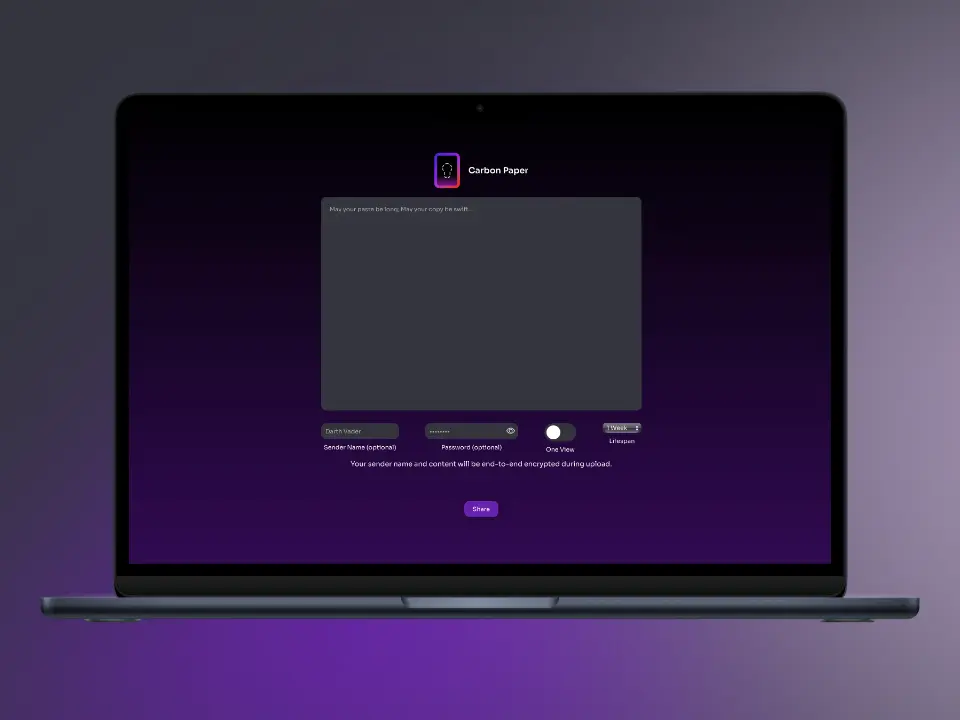
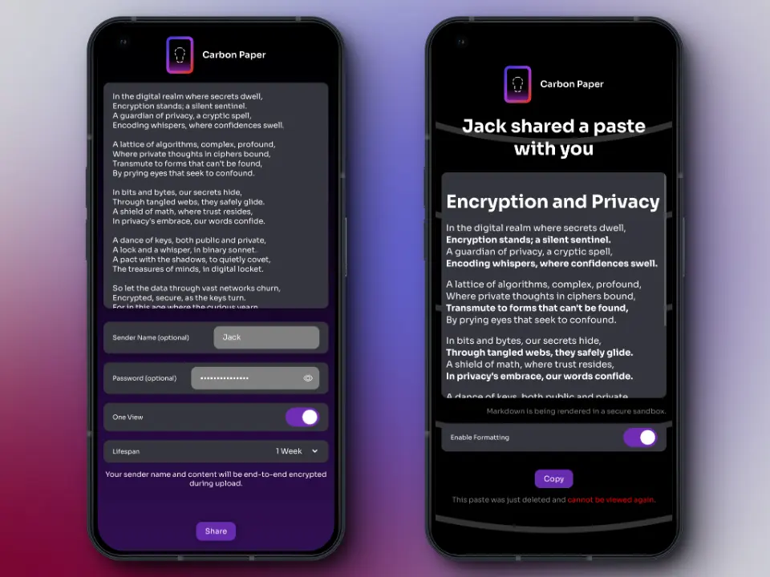

# carbon-paper

Welcome to Carbon Paper - Invisible ink for the digital age.





## What is Carbon Paper?

Carbon Paper is a pastebin app that lets you share long pieces of text in confidence. Before uploading your text to the server, it is end-to-end encrypted locally ensuring that nobody, except those whom you share the link with, knows what you wrote.

## Encryption

Carbon Paper encrypts sender names and paste content with AEAD XChaCha20-Poly1305. If a password is supplied, the paste's key is encrypted by a key derived from the password using Argon2id13. To reduce computational waste, the key encryption key is hashed with Blake3 and sent to the server. On decryption, the server will request the derived key encryption key hash before sending back ciphertext data. The password is not sent anywhere, hashed or otherwise, to prevent bruteforce attacks.

## Instances

| URL                                                    | Region  | Notes                                                                                            |
| ------------------------------------------------------ | ------- | ------------------------------------------------------------------------------------------------ |
| [paste.whatever.social](https://paste.whatever.social) | Germany | Operated by [Whatever Social](https://whatever.social) and [http.james](https://httpjames.space) |

## Deployment

Refer to the wiki for more information.

## Developing

```bash
yarn dev

# or start the server and open the app in a new browser tab
yarn dev -- --open
```

## Building

To create a production version of your app:

```bash
yarn build
```

You can preview the production build with `yarn preview`.

> To deploy your app, you may need to install an [adapter](https://kit.svelte.dev/docs/adapters) for your target environment.
